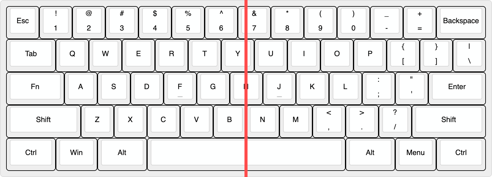
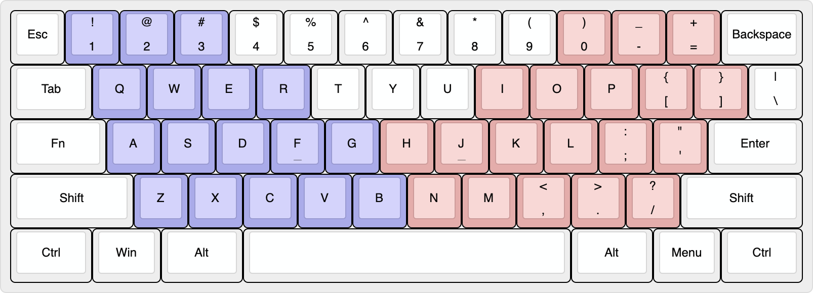
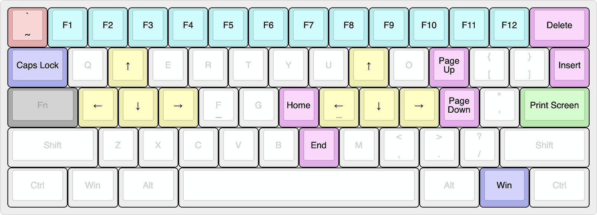

<h2 align="center">60% Mechanical Keyboard</h1>
  
LXKB is an open-source project that makes minimal keyboard with 60 keys.

# Introduction

### Who is it for?
For coders, writers and for everyone.  
This allows for fast typing with minimal movement.
In addition, it minimizes the burden on the shoulder even for long time use.
You should use a minimal keyboard for shoulder health.
A 60% keyboard is best for that.  
So, is LXKB different from the normal 60% keyboard?
It's in the aesthetics of this keyboard.

### Aesthetics
is realized in Symmetry.  
The following is the layout of LXKB for Windows. *[*see more layouts](layout.md)*

It is a completely symmetrical design.  
Draw a line in the center:

Row 1, 2 are diagonally symmetric. And row 3 to 5 are perfectly symmetrical.
As is known, most people feel psychologically secure in symmetry.

### Feature
The most striking feature is the position of the Fn key.
The usage of Caps lock is very infrequent. But among the non-letter keys, it is located in the most convenient place to press. This place is a waste for Caps lock! It is why we put Fn key here.  
We have placed the rest of combination keys where comfortable to press.
People place their hands diagonally on the keyboard for body structural reasons. Therefore, the range of keys that can be pressed by moving only a finger from the default position is as follow:

Blue is left hand, red is right hand. Since the left hand presses the Fn key, the combination keys are placed in the red range. Here is the result:

### Inspired by
This layout is inspried by [these keyboards](./inspired.md).

# Goals
We want to provide sources for making keyboards that is:
- Gerber files for ordering PCB
- Draw files for ordering Case
- Keymap.json file for QMK Configurator
- Documentation for ordering, assembly and setting from zero to finished product

# Contribute
Do you want to help? That’s awesome. We welcome contributions of all kinds from everyone.

# License
Licensed under the [CC BY-NC-SA 4.0](./LICENSE).  
Almost everything is permitted, but not for commercial use.
