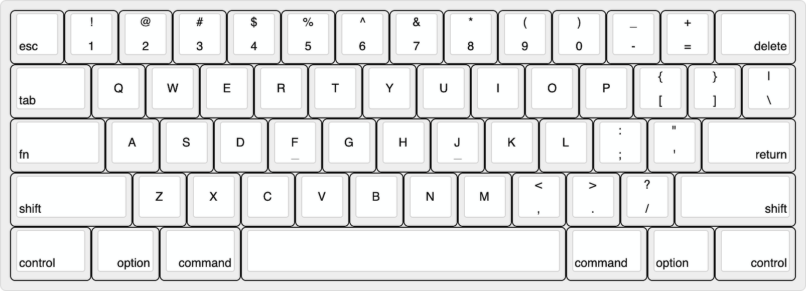
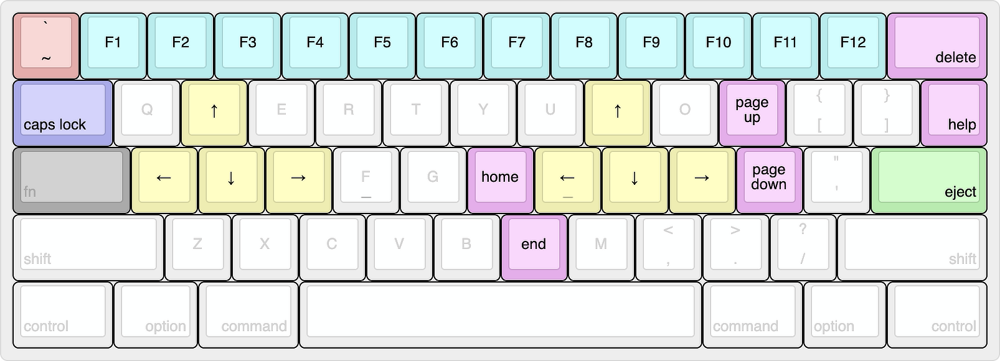

# Layouts of LXKB

- [LXKB for Windows](http://www.keyboard-layout-editor.com/#/gists/499662763cf8b9fc48e7f24f23e9895a)

- [LXKB for Windows - Fn combined](http://www.keyboard-layout-editor.com/#/gists/9ed083197440aef61fcd359ec48cc0b2)

- [LXKB for MacOS](http://www.keyboard-layout-editor.com/#/gists/e5a1952ee05224aab8b0ef7e21352cde)

- [LXKB for MacOS - Fn combined](http://www.keyboard-layout-editor.com/#/gists/0dadb3639b67f5e03f305343836615cb)

